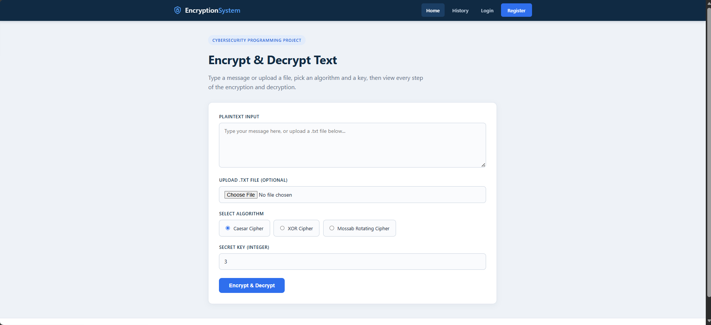
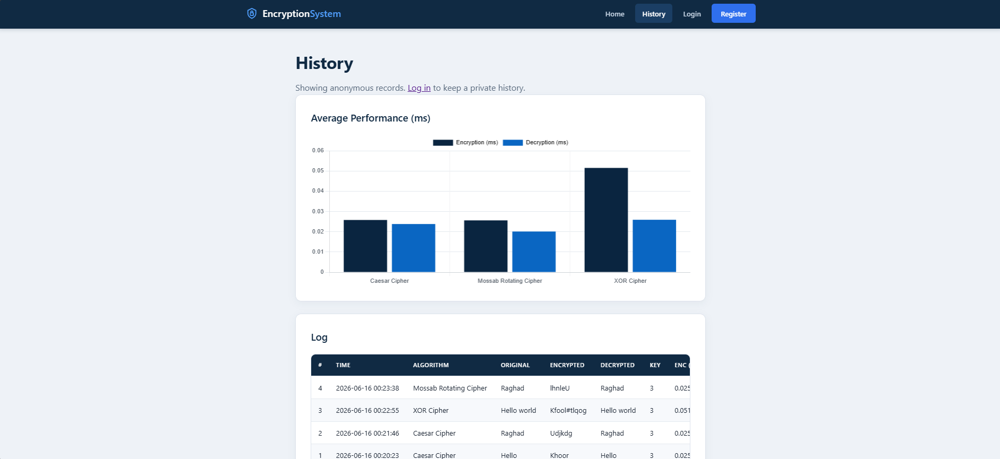
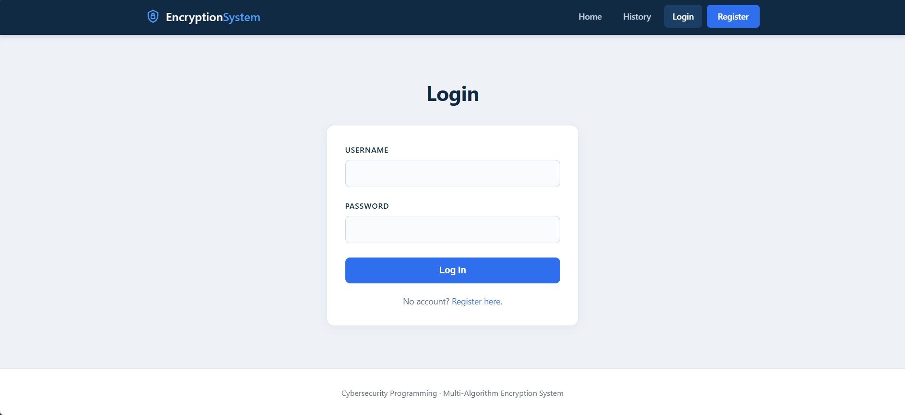
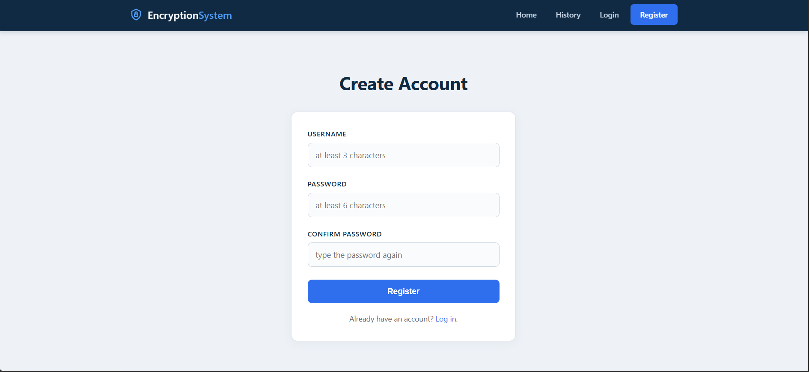

# Multi-Algorithm Text Encryption & Decryption System

A Flask web app that encrypts and decrypts text using three algorithms — Caesar, XOR, and the custom Mossab Rotating Cipher (MRC) — with full step-by-step output.

## Screenshots

### Home


### History & Performance Chart


### Login


### Register


## Features

- Text input or `.txt` file upload
- Three algorithms: Caesar, XOR, MRC
- Step-by-step encryption and decryption details
- Download encrypted / decrypted output (`.txt`)
- Encryption history stored in SQLite
- Execution time measured in milliseconds
- Performance comparison chart
- User accounts with login (each user sees only their own records)

## Tech Stack

- Python 3
- Flask, Flask-Login
- SQLite
- HTML, CSS, Jinja2
- Chart.js

## Project Structure

```
project/
├── app.py              # Flask routes, file handling, database, login
├── encryption.py       # Caesar, XOR and MRC cipher logic
├── requirements.txt    # Python dependencies
├── README.md
├── .gitignore
├── templates/          # Jinja2 HTML templates
│   ├── base.html
│   ├── index.html
│   ├── result.html
│   ├── history.html
│   ├── login.html
│   └── register.html
├── static/
│   └── style.css
├── screenshots/        # Images used in this README
└── uploads/            # Uploaded .txt files (ignored by git)
```

## Setup

```bash
python -m venv venv
venv\Scripts\activate        # Windows
# source venv/bin/activate   # macOS / Linux
pip install -r requirements.txt
```

## Run

```bash
python app.py
```

Open http://127.0.0.1:5000 in a browser.


## Algorithms

| Algorithm | Encryption | Decryption |
|-----------|------------|------------|
| Caesar | `E(x) = (x + k) mod 26` | `D(x) = (x - k + 26) mod 26` |
| XOR | `E(x) = x XOR k` | `D(x) = E(x) XOR k` |
| MRC | `Ei = ASCII(Ci) + k + i`, then reverse | reverse, then `Di = ASCII(Ei) - k - i` |

Example: `HELLO` with key `3` → MRC → `VRQIK` → `HELLO`.
